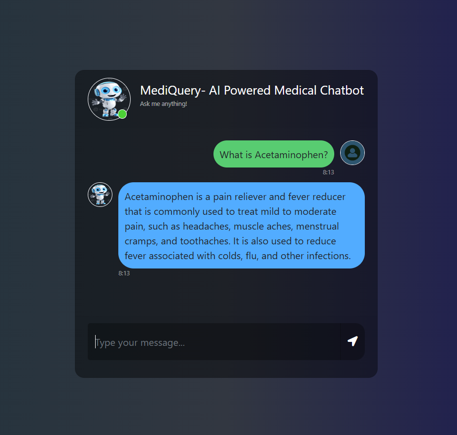

# MediQuery
## AI-Powered Medical Chatbot

## 🩺 Overview
This project is an **AI-powered medical chatbot** using **Llama-2 (7B) LLM**, **Pinecone**, and **LangChain** to answer medical queries from a vectorized knowledge base.

## 🚀 Features
- **Conversational AI:** Context-aware responses to medical queries  
- **Semantic Search:** Powered by **Pinecone Vector Store**   

## 🛠️ Tech Stack
- **Frontend:** HTML, CSS, Javascript (Bootstrap) 
- **Backend:** Python (Flask)  
- **LLM:** Llama-2 (7B) via CTransformers  
- **Database:** Pinecone (AWS, us-east-1) with LangChain  
- **Embeddings:** Hugging Face Models  

✅ Developed an AI-powered medical chatbot using Python (Flask), Llama-2, Pinecone, and LangChain.
✅ Implemented semantic search with Pinecone Vector Database to retrieve relevant medical information.
✅ Integrated Llama-2 (7B model) with CTransformers to generate context-aware medical responses.
✅ Pre-processed and embedded medical documents for improved query retrieval using LangChain.
✅ Optimized retrieval-based QA pipeline using cosine similarity metric for high-accuracy results.
✅ Designed a custom prompt template to ensure accurate, reliable, and structured medical responses.
✅ Deployed serverless infrastructure on Pinecone (AWS - us-east-1 region) for scalable and fast vector searches.



---

## 📥 Installation & Usage

1️⃣ Clone the Repository
   ```bash
   git clone https://github.com/your-username/Medical-ChatBot.git
    cd Medical-ChatBot

   ```

2️⃣ Create a Virtual Environment
   ```bash
   python -m venv venv
   source venv/bin/activate   # Linux/Mac
   venv\Scripts\activate      # Windows
   ```
3️⃣ Install Dependencies
   ```bash
   pip install -r requirements.txt
   ```

4️⃣ Set Up Environment Variables
   ```bash
   Create a .env file in the project root:

    PINECONE_API_KEY=your_pinecone_api_key
   ```

5️⃣ Run the Application
```bash
   python app.py
   ```
   The app will be live at 👉 http://127.0.0.1:5000/

6️⃣ Interact with the Chatbot

Open the browser and start asking medical queries 💬.
---